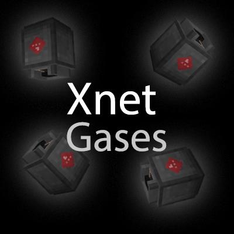

# XNet Gases

CurseForge: https://www.curseforge.com/minecraft/mc-mods/xnet-gases  
Modrinth: https://modrinth.com/mod/xnet-gases

Allows XNet to transport Mekanism chemicals. Gases, slurries, pigments and infuse.

Requires [XNet](https://modrinth.com/mod/xnet), [Mekanism](https://modrinth.com/mod/mekanism) and the respective dependencies.

The channel functions pretty much like the fluid channel in XNet with the following features:
- selecting which type of chemical to move (gas, infuse, pigment, slurry)
- round-robin or priority mode
- delay, transfer limiter and capacity limit
- filter where any tank with a chemical can be used

In addition to a channel dedicated for transporting chemicals, there is a separate logic channel type for redstone logic.